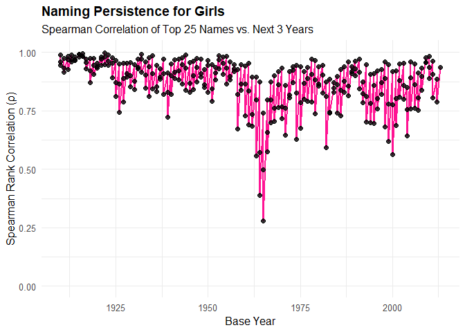
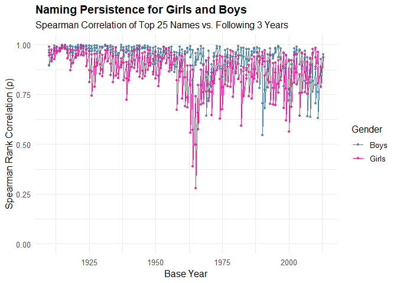
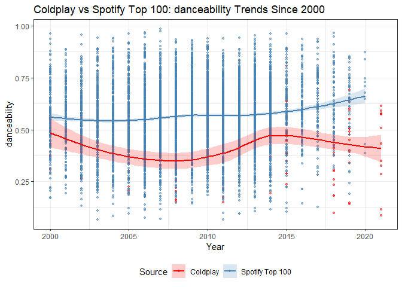
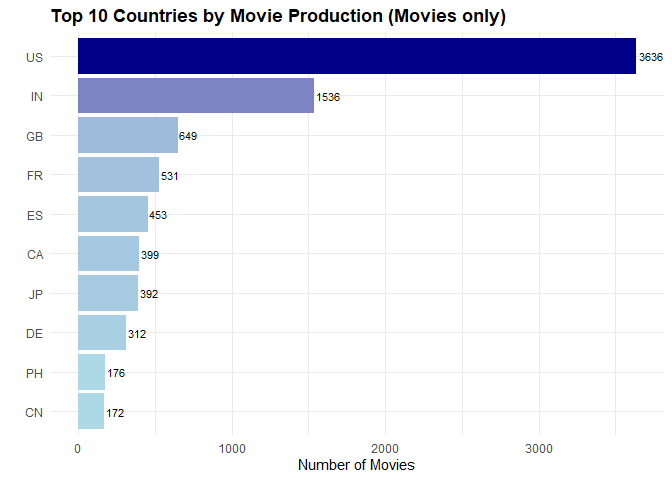
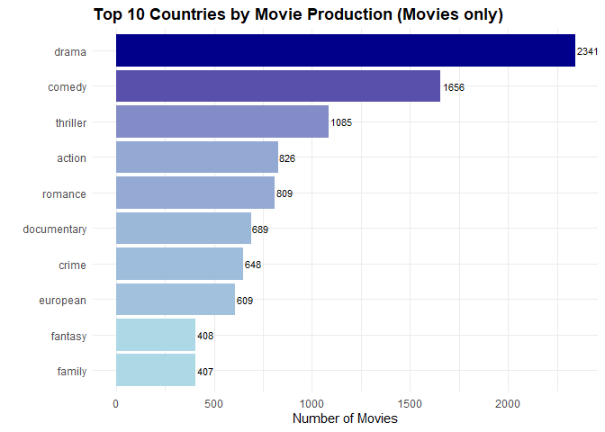
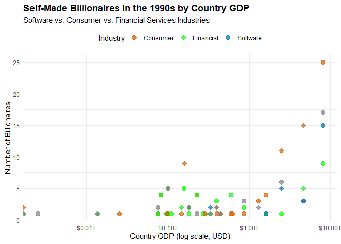
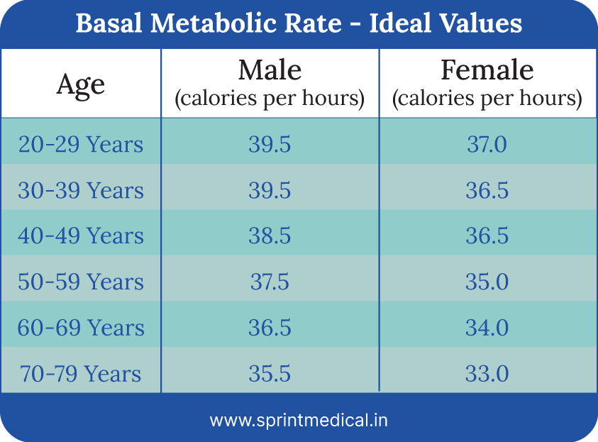

# Purpose

This README will take you through my DATA Science 871 exam. All
questions, data wrangling and analyses will be outlined in this
document.

``` r
rm(list = ls()) # Clean your environment:
gc() # garbage collection - It can be useful to call gc after a large object has been removed, as this may prompt R to return memory to the operating system.
```

    ##           used (Mb) gc trigger (Mb) max used (Mb)
    ## Ncells  548107 29.3    1222830 65.4   686380 36.7
    ## Vcells 1047907  8.0    8388608 64.0  1876260 14.4

``` r
library(tidyverse)
```

    ## ── Attaching core tidyverse packages ──────────────────────── tidyverse 2.0.0 ──
    ## ✔ dplyr     1.1.4     ✔ readr     2.1.5
    ## ✔ forcats   1.0.0     ✔ stringr   1.5.1
    ## ✔ ggplot2   3.5.1     ✔ tibble    3.3.0
    ## ✔ lubridate 1.9.4     ✔ tidyr     1.3.1
    ## ✔ purrr     1.0.4     
    ## ── Conflicts ────────────────────────────────────────── tidyverse_conflicts() ──
    ## ✖ dplyr::filter() masks stats::filter()
    ## ✖ dplyr::lag()    masks stats::lag()
    ## ℹ Use the conflicted package (<http://conflicted.r-lib.org/>) to force all conflicts to become errors

``` r
library(lubridate)
library(stringr)
library(readr)
library(ggridges)
library(ggplot2)
library(viridis)
```

    ## Loading required package: viridisLite

``` r
library(hrbrthemes)
library(ggstream)
library(broom)
library(tidyfit)
```

    ## 
    ## Attaching package: 'tidyfit'
    ## 
    ## The following object is masked from 'package:dplyr':
    ## 
    ##     explain

``` r
library(fmxdat)

# Load functions from all question projects

list.files('code/', full.names = T, recursive = T) %>% .[grepl('.R', .)] %>% as.list() %>% walk(~source(.))

# Creation of question folders
library(Texevier)

#fmxdat::make_project(Open = T)

#just to show I can use glue::glue :)

# CHOSEN_LOCATION <- "C:/Users/Charisa/OneDrive - Stellenbosch University/Documents/22894551_Exam"
# 
# Texevier::create_template(directory = glue::glue("{CHOSEN_LOCATION}/"), template_name = "Question1")
# Texevier::create_template(directory = glue::glue("{CHOSEN_LOCATION}/"), template_name = "Question2")
# Texevier::create_template(directory = glue::glue("{CHOSEN_LOCATION}/"), template_name = "Question3")
# Texevier::create_template(directory = glue::glue("{CHOSEN_LOCATION}/"), template_name = "Question4")
# Texevier::create_template(directory = glue::glue("{CHOSEN_LOCATION}/"), template_name = "Question5")

# I added the data to the respective question data folders
# I also added the instruction PDF to the settings folder of the root. 
```

# QUESTION 1: US BABY NAMES

Step 1: uploading the data, view the format with view(Baby\_/Names)

``` r
Baby_Names <- read_rds("./data/PracData25/US_Baby_names/Baby_Names_By_US_State.rds")
Top_100_Billboard <- read_rds("./data/PracData25/US_Baby_names/charts.rds")
HBO_titles <- read_rds("./data/PracData25/US_Baby_names/HBO_titles.rds")
HBO_credits <- read_rds("./data/PracData25/US_Baby_names/HBO_credits.rds")

view(Baby_Names)
view(Top_100_Billboard)
view(HBO_titles) # need to merge these to to have the release date with the actors/ characters names
view(HBO_credits)

#Join the HBO titles and credits
HBO_joined <- HBO_credits %>%
  left_join(HBO_titles, by = "id")
```

I came across a biggggg issue with the naming conventions of the “year”
and “name” columns, so I decided to rather change the functions back to
using “name” and “year” for simplicity and to then rename the columns in
each dataset. This felt more simple!

``` r
#tidy up the column names for ease of use: 
Baby_Names <- Baby_Names %>%
  rename(name = Name) %>% rename(year = Year)

#Now, since I want to compare the correlation for girls and boys separately, I need to infer the gender of the HBO and Billboard lists - which I can do by looking each name up in the US-babynames dataset.

# add gender & rename name columns

Top_100_Billboard <- Top_100_Billboard %>% rename(name = artist) #the dates is in numeric here, can add year col
Billboard_MF <- add_gender(df = Top_100_Billboard) %>% mutate(year = year(date)) 

#Hbo artists
HBO_MF <- add_gender(HBO_joined) %>% rename(year = release_year)

#HBO_MF_new <- charadd_gender(HBO_MF)

#now apply to character
HBO_characters_MF <- HBO_MF %>%  rename(actor_name = name) %>% rename(name = character) 


# drop unnecessary dataframes
rm(Top_100_Billboard, HBO_credits, HBO_titles, HBO_joined)
```

### Planning:

I will work at a national level. I want to have a summary table (bubble
plot) at the end with the 5 most popular names for each decade for boys
and girls. Interesting: Comparing persistence between TV characters and
actors/ music songs or artists

1.  factors influencing naming
2.  persistence of the trends

Putting this on a plot e.g. with Years or Decades on the Y-axis and most
popular Names on the X (N being the size of the name bubble), popular
character names in adult or children series. . . ’ ’

First I need to find the most popular baby names in each year and the
most popular TV celebrities in each year and the most popular songs /
artists in each year

## Baby Names

Since I want to work with decades: I need to create some functions that
will sort the names in the top 25 order for each decade.

``` r
#check if year is numeric
str(Baby_Names$year)
```

    ##  num [1:5647426] 1910 1910 1910 1910 1910 ...

``` r
#create function to add decade column: decade_creator
#create function to create top25 names with a gender filter: Top25_Names_decade
```

It works better if I combine these two functions into the
Top25_Names_decade function!

``` r
# create top25 lists with the decade_Creator function and arrange by popularity
# just checking that it works: 

Top25_boynames_decade <- Top25_Names_by_Decade(Baby_Names, gender_filter = "M")
Top25_girlnames_decade <- Top25_Names_by_Decade(Baby_Names, gender_filter = "F")
```

I first created a function only for one of the genders and then amended
it to be more generic with a gender_filter so that we can use it
throughout.

### Top25_plot

``` r
# I loaded my plot_orderset function

top25_girlsplot <- top25_plot(df = Baby_Names, xaxis_size = 10, xaxis_rows = 2, gender_filter = "F")
top25_girlsplot
```


``` r
top25_boysplot <- top25_plot(df = Baby_Names, xaxis_size = 10, xaxis_rows = 2, gender_filter = "M")
top25_boysplot
```


I further wanted to identify names that were taken up more than usual in
each decade. So I created a function to extract that. Afterwards, I
added another geom_text to name each of the top 3 names taken up such
that

### Increase year-on-year

Create function for the increase year-on-year by decade! Now I can see
the surges. I also added the function that it shows the top 3 names each
decade and makes them a different colour.

``` r
top25_increaseplot(Baby_Names)
```

    ## Warning: Removed 123 rows containing missing values or values outside the scale range
    ## (`geom_point()`).


``` r
top25_increaseplot(Baby_Names, gender_filter =)
```

    ## Warning: Removed 123 rows containing missing values or values outside the scale range
    ## (`geom_point()`).


## Most popular names per decade

Since there are so many names and that becomes cluttered, I opted to
plot this with only the top 3 names per decade.

``` r
top3namesuptake <- get_top3_increasing_names(Baby_Names)
top3namesuptake
```

    ## # A tibble: 11 × 3
    ##    Decade `Top 3 Names`             `Percentage Increase`             
    ##     <dbl> <chr>                     <chr>                             
    ##  1   1910 Abbie, Abigail, Ada       NA, %, NA, %, NA, %               
    ##  2   1920 Sharon, Colleen, Leatrice 13020, %, 7100, %, 6677.8, %      
    ##  3   1930 Saundra, Marlene, Lynda   16085.7, %, 10628.5, %, 10211.8, %
    ##  4   1940 Sharyn, Melody, Cheri     58200, %, 54633.3, %, 53420, %    
    ##  5   1950 Sheree, Geralyn, Tami     101800, %, 40900, %, 34818.8, %   
    ##  6   1960 Tiffany, Lara, Tabitha    162880, %, 76700, %, 42720, %     
    ##  7   1970 Lakisha, Tanisha, Carly   87814.3, %, 58811.1, %, 50360, %  
    ##  8   1980 Mallory, Tierra, Savannah 124116.7, %, 76400, %, 52868.8, % 
    ##  9   1990 Justice, Payton, Camryn   87340, %, 53607.7, %, 51816.7, %  
    ## 10   2000 Khloe, Meadow, Saniya     64670, %, 49180, %, 44075, %      
    ## 11   2010 Milania, Paisleigh, Mavis 7862.5, %, 6160, %, 6140, %

``` r
top3namesuptakeboys <- get_top3_increasing_names(Baby_Names, gender_filter = "M")
top3namesuptakeboys
```

    ## # A tibble: 11 × 3
    ##    Decade `Top 3 Names`              `Percentage Increase`             
    ##     <dbl> <chr>                      <chr>                             
    ##  1   1910 Aaron, Abbott, Abdon       NA, %, NA, %, NA, %               
    ##  2   1920 Bobby, Harding, Donn       8892.7, %, 8680, %, 6820, %       
    ##  3   1930 Darryl, Ronnie, Jan        11340, %, 10505.1, %, 7618.8, %   
    ##  4   1940 Rickey, Ricky, Gregg       62616.7, %, 58636.4, %, 20950, %  
    ##  5   1950 Kelvin, Darren, Bret       79616.7, %, 35900, %, 17247.6, %  
    ##  6   1960 Darin, Darrin, Darron      22034.4, %, 19529.4, %, 13654.5, %
    ##  7   1970 Zachariah, Marquis, Jeramy 27860, %, 18442.9, %, 17516.7, %  
    ##  8   1980 Dakota, Akeem, Colton      15915.4, %, 14154.5, %, 10875, %  
    ##  9   1990 Jaylon, Dillion, Dylon     31866.7, %, 29400, %, 23233.3, %  
    ## 10   2000 Yahir, Jamarion, Kaeden    119840, %, 33472.7, %, 33260, %   
    ## 11   2010 Brentley, Bently, Kyrie    22060, %, 21950, %, 6068.4, %

## HBO - movies and TV

Now, since I want to compare the correlation for girls and boys
separately, I need to infer the gender of the HBO and Billboard lists -
which I can do by looking each name up in the US-babynames dataset.

! I added the genders at the beginning.

Now we can order the characters by their TMBD score in each decade and
capture the top 25 male and female actors in each decade. I first wanted
to see what the most popular names in TV characters was by applying the
top25 plot. This isn’t working right now because the column names don’t
match but I don’t want to break something that is workign for the other
functions, so I’m going to continue with the ordering!

Let’s just get the top 25 actors and actresses and the top 25 male and
female character names.

### Top 25 most popular characters overall

The setup here I don’t like so much, because the big movies’ small roles
are comiing up. I need to filter that only lead/ supporting roles come
up.

I can see the genders are mostly showing up as NA, I presume it is
because the names/ “first word” of the characters likely not correct. I
will now revisit my definition of HBO_characters_MF.

I also want some first names but it might fall away if I do first word.
Some of the character names have special characters that need cleaning

# I never got time to get this to work :(

This ALSO looks incredibly janky! I’m going to try to make it a bit more
neat by grouping by gender. I’m also only going to keep names that are
found in the baby_names list.

<!-- ```{r} -->
<!-- Top10_Table <- Top25_Characters_by_Decade %>% -->
<!--   mutate( -->
<!--     character = str_remove(character, "\\s*\\(uncredited\\)"), -->
<!--     character = str_trunc(character, 40), -->
<!--     decade = factor(decade), -->
<!--     Gender = factor(Gender, levels = c("F", "M")) -->
<!--   ) %>% -->
<!--   group_by(decade, Gender) %>% -->
<!--   slice_max(order_by = avg_score, n = 10) %>% -->
<!--   ungroup() %>% -->
<!--   arrange(decade, Gender, desc(avg_score)) %>% -->
<!--   select(Decade = decade, Gender, Character = character, `Avg TMDB Score` = avg_score, Appearances = appearances) -->
<!-- Top10_Table -->
<!-- library(gt) -->
<!-- library(huxtable) -->
<!-- ht <- as_hux(Top10_Table) -->
<!-- ht <- ht %>% -->
<!--   set_caption("Top 10 HBO Characters by Gender and TMDB Score per Decade") %>% -->
<!--   set_bold(1, everywhere, TRUE) %>% -->
<!--   set_number_format(everywhere, "Avg TMDB Score", fmt_pretty(1)) %>% -->
<!--   set_all_border_colors("grey90") %>% -->
<!--   set_all_padding(2) -->
<!-- ht -->
<!-- ``` -->

## BILLBOARD - musicians

I will see if I get to comparing these! It can be interesting to filter
the songs to only those containing a name that appears in the babyname
list.

``` r
library(dplyr)
library(lubridate)

billboard_top10 <- Billboard_MF %>%
  mutate(
    rank = as.numeric(rank),        # Convert rank to numeric
    year = year(date),              # Extract year from date
    decade = floor(year / 10) * 10  # Calculate decade
  ) %>%
  filter(rank >= 1, rank <= 10) %>% 
     distinct(song, .keep_all = TRUE)
```

## COMPARISON OF MATCHES

I want to find the top (n) baby names and see if they match the top (n)
actors and characters in that decade. I use a threshold for a movie to
be considered influential - only the popular movies are likely to have a
big impact on naming. I only take the top 50 actors.

I will create a function that gets the top increasing names, and then
compare them to the top movie actors/actresses in that decade, as well
as the popular movie characters in that decade to find “matches” within
decades and then we can see when it was most popular to do so and
whether it is still a trend in this decade to name your children after
movies/characters.

function: findmatches -\> not working so well function: newfindmatches
-\> will print a message saying what % matches there were!

This chunk is not working :( Need to come back to this!

``` r
# result_girls <- findmatches_and_matchrate(Baby_Names, top_n = 25)
# print(result_girls$message)
# 
# result_boys <- findmatches_and_matchrate(Baby_Names, gender_filter = "M", top_n = 25)
# print(result_boys$message)

# let's just create a table with some observations we saw from looking at the data! 
library(xtable)

# Create the data
name_table_data <- data.frame(
  Name = c("Donna", "Dorothy", "Diane", "Barbara", "Elizabeth"),
  Type = c("Song name", "Character", "Song", "Actress", "Public figure"),
  Example = c(
    '"Donna" - Ritchie Valens',
    'Dorothy Gale - The Wizard of Oz',
    '"Jack and Diane" - John Mellencamp',
    'Barbra Streisand', 
    'Queen Elizabeth'
  )
)

# Create xtable
name_xtable <- xtable(name_table_data, 
                     caption = "Names in Music, Film and Culture \\label{tab:names}")

# Print with formatting
print(name_xtable,
      include.rownames = FALSE,
      floating = TRUE,
      table.placement = 'H',
      caption.placement = 'top',
      comment = FALSE)
```

    ## \begin{table}[H]
    ## \centering
    ## \caption{Names in Music, Film and Culture \label{tab:names}} 
    ## \begin{tabular}{lll}
    ##   \hline
    ## Name & Type & Example \\ 
    ##   \hline
    ## Donna & Song name & "Donna" - Ritchie Valens \\ 
    ##   Dorothy & Character & Dorothy Gale - The Wizard of Oz \\ 
    ##   Diane & Song & "Jack and Diane" - John Mellencamp \\ 
    ##   Barbara & Actress & Barbra Streisand \\ 
    ##   Elizabeth & Public figure & Queen Elizabeth \\ 
    ##    \hline
    ## \end{tabular}
    ## \end{table}

## SPEARMAN CORRELATION PLOTS

We want to see naming persistence over time - thus we want to see if top
names stay top names over time (year-on-year)

What is the correlation between this period and future periods/ past
periods popularity of name usage for girls and boys.

``` r
Spearman(Baby_Names)
```



``` r
spearman_full(Baby_Names)
```



I want to see them together/ next to each other At first I did it
separately, but then i decided I want them on the same plot - the
function was so specified that I decided to break it up into two parts,
and then I could apply each part separately!

``` r
spearman_girls <- Spearman(df = Baby_Names, gender_filter = "F")
# spearman_girls

spearman_boys <- Spearman(df = Baby_Names,  gender_filter = "M")
# spearman_boys

# see side by side
cowplot::plot_grid(spearman_girls, spearman_boys, ncol = 1)
```


# Question 2: MUSIC TASTE

### Planning:

First: popularity boxplot for each band per album ridge graph for each
of the

Compare: trends in components of music for spotify trends in components
for each band (can use ridgeplot ?) ggridges

Within analysis -\> how versions (live, studio) affect metrics Metallica
-\> “One” Get a nice comparison song by Coldplay

### Data cleaning!

I had trouble with removing the special character in some of Metallica’s
album names with gsub, but it worked better with iconv ! So I created a
function to use for later also!

``` r
# upload data
coldplay <- read_csv("./data/PracData25/Coldplay_vs_Metallica/Coldplay.csv")
```

    ## Rows: 232 Columns: 15
    ## ── Column specification ────────────────────────────────────────────────────────
    ## Delimiter: ","
    ## chr   (2): name, album_name
    ## dbl  (11): duration, popularity, acousticness, danceability, energy, instrum...
    ## lgl   (1): explicit
    ## date  (1): release_date
    ## 
    ## ℹ Use `spec()` to retrieve the full column specification for this data.
    ## ℹ Specify the column types or set `show_col_types = FALSE` to quiet this message.

``` r
metallica <- read_csv("./data/PracData25/Coldplay_vs_Metallica/metallica.csv")
```

    ## Rows: 1468 Columns: 14
    ## ── Column specification ────────────────────────────────────────────────────────
    ## Delimiter: ","
    ## chr   (2): name, album
    ## dbl  (11): duration_ms, popularity, danceability, energy, loudness, speechin...
    ## date  (1): release_date
    ## 
    ## ℹ Use `spec()` to retrieve the full column specification for this data.
    ## ℹ Specify the column types or set `show_col_types = FALSE` to quiet this message.

``` r
spotify <- read_rds("./data/PracData25/Coldplay_vs_Metallica/Broader_Spotify_Info.rds")
billboard_100 <- read_rds("./data/PracData25/Coldplay_vs_Metallica/charts.rds")

#create the year cols

coldplay <- coldplay %>%
  mutate(year = year(as.Date(release_date)))

metallica <- metallica %>% 
    mutate(year = year(as.Date(release_date)))

billboard_100 <- billboard_100 %>% 
    mutate(year = year(as.Date(date)))

# Let's name the columns consistently & remove special characters in all dataframes

metallica <- metallica %>% rename(song = name) %>% mutate(artist = "Metallica") # remove special isn't working yet
coldplay <- coldplay %>% rename(album = album_name, song = name) %>%  mutate(artist = "Coldplay")
spotify <- spotify %>% rename(song = name)

# billboard is fine

#remove the special characters
# these options didnt work
# metallica %>% 
#       mutate(album = gsub("�", "", album))
#         mutate(album = gsub("\uFFFD", "", album, fixed = TRUE))
# 
# metallica %>%
#   mutate(album = gsub("[^[:ascii:]]", "", album))

# metallica %>%
#   mutate(album = iconv(album, from = "UTF-8", to = "ASCII", sub = ""))

#creaated a function that works
metallica <- remove_special(metallica, album)
```

    ## Warning: There was 1 warning in `mutate()`.
    ## ℹ In argument: `across(album, iconv, from = "UTF-8", to = "ASCII", sub = "")`.
    ## Caused by warning:
    ## ! The `...` argument of `across()` is deprecated as of dplyr 1.1.0.
    ## Supply arguments directly to `.fns` through an anonymous function instead.
    ## 
    ##   # Previously
    ##   across(a:b, mean, na.rm = TRUE)
    ## 
    ##   # Now
    ##   across(a:b, \(x) mean(x, na.rm = TRUE))

``` r
coldplay <- remove_special(coldplay, album)

# remove_special characters
glimpse(metallica)
```

    ## Rows: 1,468
    ## Columns: 16
    ## $ song             <chr> "72 Seasons", "Shadows Follow", "Screaming Suicide", …
    ## $ album            <chr> "72 Seasons", "72 Seasons", "72 Seasons", "72 Seasons…
    ## $ duration_ms      <dbl> 459120, 371880, 330453, 416067, 423013, 201760, 34940…
    ## $ popularity       <dbl> 71, 70, 68, 68, 67, 68, 66, 65, 66, 66, 65, 66, 53, 4…
    ## $ release_date     <date> 2023-04-14, 2023-04-14, 2023-04-14, 2023-04-14, 2023…
    ## $ danceability     <dbl> 0.196, 0.316, 0.427, 0.450, 0.235, 0.401, 0.441, 0.25…
    ## $ energy           <dbl> 0.981, 0.978, 0.973, 0.949, 0.958, 0.996, 0.963, 0.98…
    ## $ loudness         <dbl> -3.865, -3.937, -3.469, -4.181, -3.069, -3.327, -3.98…
    ## $ speechiness      <dbl> 0.0574, 0.0507, 0.0445, 0.0343, 0.0426, 0.0714, 0.036…
    ## $ acousticness     <dbl> 4.16e-05, 1.06e-04, 2.66e-05, 2.13e-05, 8.97e-05, 1.1…
    ## $ instrumentalness <dbl> 5.20e-02, 3.25e-02, 2.00e-02, 4.04e-02, 1.73e-02, 8.7…
    ## $ liveness         <dbl> 0.0636, 0.3250, 0.2600, 0.0977, 0.0374, 0.1210, 0.058…
    ## $ valence          <dbl> 0.403, 0.671, 0.317, 0.530, 0.453, 0.226, 0.245, 0.68…
    ## $ tempo            <dbl> 168.183, 178.554, 100.979, 124.949, 172.774, 130.596,…
    ## $ year             <dbl> 2023, 2023, 2023, 2023, 2023, 2023, 2023, 2023, 2023,…
    ## $ artist           <chr> "Metallica", "Metallica", "Metallica", "Metallica", "…

``` r
# filter only for studio albums!

metallica_studio <- metallica %>%
  filter(!grepl("live|Live|LIVE|Remastered|Remaster|Deluxe", album, ignore.case = TRUE))
coldplay_studio <- coldplay %>% 
    filter(!grepl("live|Live|LIVE|Remastered|Demo|Deluxe", album, ignore.case = TRUE))

metallica_live <- metallica %>% 
    filter(grepl("live|Live|LIVE", album, ignore.case = T))

coldplay_live <- coldplay %>% 
    filter(grepl("live|Live|LIVE", album, ignore.case = T))

# create a list of spotify songs that reached the top 100 on billboard
spotify_top100 <- top100(spotify)

# create one dataframe wit coldplay and metallica studio albums together
together_studio <- bind_rows(metallica_studio, coldplay_studio)
```

To have a good comparison group for trends in popular music, I created a
Spotify list that only contains songs that were also on the Billboard
Top 100. I created the function called top100 for this.

``` r
spotify_top100 <- top100(spotify)
```

## Boxplots of album popularity

Just some regular boxplots. I also then divided it up by live and
remastered albums for the respective bands for more sleek graphs because
it was looking a bit too cluttered.

The popularity of each of the bands are shown in a box-and-whiskers
plot, showing the popularity scores per album.

## Coldplay

### Overall

``` r
albumpop_CP <- boxplotpopbyalbum(coldplay)
albumpop_CP
```

 Coldplay is
known for its live albums, with the live albums of “Live in Bueonos
Aires” and “Live 2012” surpassing albums like “Love in Tokyo” and
“Everyday Life” in popularity.

### Live

``` r
albumpop_CPL <- boxplotpopbyalbum(coldplay_live)
albumpop_CPL 
```


## Metallica

### Overall

``` r
albumpop_ML <- boxplotpopbyalbum(metallica)
albumpop_ML
```

 For
Metallica, the remastered albums gain more traction, as seen by 7 of the
top 10 most popular albums being remastered albums.

### Studio

``` r
albumpop_MLS <- boxplotpopbyalbum(metallica_studio)
albumpop_MLS
```


## Violin plots for song popularity within each album

I saw on R graph gallery there are some nice new plots! Yay! So I can
pick some for the rest of the analysis.

Now let’s look deeper into the popularity of the songs within each
album. I created the function for this -\> see songsinalbum_pop

``` r
songspop <- songsinalbum_pop(together_studio)
```

## Ridgeline plot of trends in the components over time

WIll be able to see over the years what type of music they started to do
At first I tried this ggridges, but since there are so many years it is
not great. I think I’ll rather use the trends by components.

Now I can compare the trends for both bands to popular spotify songs!
First I need to create the function for the plots!

I see now that the spotify timeframe is not the same as coldplay. Let’s
adjust Spotify by adding a filter that the minimum year is the same as
the artist (this will be helpful for Metallica!

## Timetrends

Now I can do this for different components, whichever suits the band
best.

``` r
timetrend_CP_dance<- timetrend_comp(df = coldplay_studio, artist = "Coldplay", variable = "danceability")
library(glue)
timetrend_CP_dance
```

    ## `geom_smooth()` using formula = 'y ~ x'



\## Compare studio vs Live albums

Since I already created a live dataframe and a studio dataframe for
ecah, I can just use that as the “comparison group” as I had spotify
earlier. I just adusted the function a little and created a new one with
the right dataframe references, because spotify was coded into the
function earlier.

``` r
# Live vs Studio albums
#We can see that energy trends are much lower in Live albums, for both Coldplay and Metallica, but especially for Metallica. 
liveCP <- live_timetrend_comp(coldplay, coldplay_live, artist_name = "Coldplay Studio", compare_name = "Live Albums", variable = "energy")
liveCP
```

    ## `geom_smooth()` using formula = 'y ~ x'


``` r
liveML <- live_timetrend_comp(metallica, metallica_live, artist_name = "Metallica Studio", compare_name = "Live Albums", variable = "energy")
liveML
```

    ## `geom_smooth()` using formula = 'y ~ x'


The PDF was knitting the plots out of frame so I just adjusted those
figures with a fig.pos.

I still need to add some write-up and just decided which boxplots to
include in the final PDF.

# Question 3: Netflix

Load the data:

## upload data

``` r
Titles <- read_rds("./Question3/data/netflix/titles.rds")
Credits <- read_rds("./Question3/data/netflix/credits.rds")
Movie_Info <- read_csv("./Question3/data/netflix/netflix_movies.csv")
```

    ## Rows: 6131 Columns: 12
    ## ── Column specification ────────────────────────────────────────────────────────
    ## Delimiter: ","
    ## chr (11): show_id, type, title, director, cast, country, date_added, rating,...
    ## dbl  (1): release_year
    ## 
    ## ℹ Use `spec()` to retrieve the full column specification for this data.
    ## ℹ Specify the column types or set `show_col_types = FALSE` to quiet this message.

## Data cleaning!

I started by looking at Titles.

I cleaned the genres and production countries columns -\> now I’m going
to look at which countries produce the most movies, and see then which
genres they produce.

I think I will be able to create a ridgesplot here finally! yay!

``` r
Titles <- clean_genres_titles(Titles)
Titles <- clean_production_countries(Titles)
```

First i created a top10 countries function on its own, but i rather
combined it with the plot function to become top10countires_plot

## Plot 1 : Top contries

``` r
top10countries_plot <- top10_plot(Titles, "production_countries")
top10countries_plot
```



## Plot 2 : Genre popularity

The most common movie genres by movie production count are drama and
comedy, followed by thriller and action. This says nothing about the
quality of movies or if th movies were popular and successful.

``` r
top10genres_plot <- top10_plot(Titles, "genres")
top10genres_plot
```



## Genre ratings of top countries

###Ridge plots I will adjust the ridgesplot function I created for
question 2 but didn’t use here! I now created ggridgesplot. I added the
mean score to the plot, added the average mean point. I changed the
display around a bit but it actually looks best if I just keep the mean
point small and then add the text on top of that. The genres with the
highest average rating overall is documentary and history. This is not
significantly higher than many other genres, often only being 0.1 points
above another, ona scale of 1-10.

``` r
ggridgeIMDBscore <- ggridgesplot(Titles)
ggridgeIMDBscore
```

    ## Picking joint bandwidth of 0.261

    ## Warning: Removed 661 rows containing non-finite outside the scale range
    ## (`stat_density_ridges()`).


## Length of top rated movies

Here i can use the violin plot I used earlier for the song popularity! I
also want to do the ggstream somewhere :) The IMDB scores were a good
idea but they are looking a bit ugly. So I removed the jitter_plot!

``` r
violin_lengthplot(Titles)
```


## Rating of movies by runtime

As we can see in the scatterplot, the movies with the highest ratings
(above the 7.5 threshold), are of various lengths. However, it remains
bundled between 60 and 120 minutes.

``` r
movie_scatterplot(Titles)
```


# Question 4:

### Planning:

1.  Create the bespoke function to get the data into R based on
    stackoverflow.

joh that was a struggle! I first tried to do all the columns at once
with c(.. .. .. ), but you can’t do that before :=. then I specified all
of the non-character (default) ones and it worked! yay! also when you
use janitor to make it snake case it makes everything characters, so I
just changed it back to the right numeric/ integer afterwards.

I also create decade and a self_made

``` r
file_path = "./data/PracData25/Billions/billionaires.csv"

Billions <- "./data/PracData25/Billions/billionaires.csv" %>% bespoke_function()
```

1.  main points \## Countries of generational wealth

I created a function to plot the proportion of self-made vs inherited
billionaires -\> propbills

``` r
USpropbills <- propbills(Billions, location_region = "North America")
#i tried to do all other than US: 
#notUSpropbills <- Billions %>% filter(location_region != "North America") %>% propbills()
```

but that didn’t work. So I ended up just creating a little extra
function to look at the non-US!

``` r
# all other than us: 
nonUSpropbills <- Billions %>% filter(location_region != "North America") %>% propbills_noregion()
cowplot::plot_grid(USpropbills, nonUSpropbills)
```


## Industries of self-made millionaires in the 90s

I made a function for this to do a scatterplot with a trendline, but it
looks very bad, so i am opting for a ggridges again - i can adapt my q3
ggridges function to work here! I also decided to include the financial
sector, as it looked prominent when I had a look at the numbers.

``` r
# just having a look at the numbers
Billions %>% filter(self_made == "TRUE") %>% group_by(industry, year) %>% count()
```

    ## # A tibble: 53 × 3
    ## # Groups:   industry, year [53]
    ##    industry               year     n
    ##    <chr>                 <int> <int>
    ##  1 0                      1996     4
    ##  2 0                      2001     2
    ##  3 0                      2014     4
    ##  4 Constrution            1996     9
    ##  5 Constrution            2001     7
    ##  6 Constrution            2014    35
    ##  7 Consumer               1996    30
    ##  8 Consumer               2001    40
    ##  9 Consumer               2014   166
    ## 10 Diversified financial  1996    18
    ## # ℹ 43 more rows

``` r
# example of what didn't work
billions_sectors90s(Billions)
```

    ## Warning in scale_x_continuous(labels = scales::dollar_format(scale = 1e-12, :
    ## log-10 transformation introduced infinite values.



## Sectoral analysis

software vs consumer sector by region (based on country GDP)

``` r
library(ggridges)
ggridgesbillions(Billions)
```

    ## Warning in geom_density_ridges(stat = "identity", scale = 0.9, alpha = 0.7, :
    ## Ignoring unknown parameters: `bandwidth`


## Heatmap of Billionaires in the world

I got the map from the rnaturalearth package that is referenced on r
graph gallery. The data one has the column to match with -\> now I can
create it. I also added a tag with the country with the most! I realised
now that the column names of the countries don’t always match, that’s
why the distrib is different. If I have time I will get back to this!

``` r
if(!require("rnaturalearth")) {install.packages("rnaturalearth", repos = "https://cloud.r-project.org/")
  library("rnaturalearth")}
```

    ## Loading required package: rnaturalearth

``` r
if(!require("rnaturalearthdata", quietly = TRUE)) {
  install.packages("rnaturalearthdata", repos = "https://cloud.r-project.org/")
  library(rnaturalearthdata)}
```

    ## 
    ## Attaching package: 'rnaturalearthdata'

    ## The following object is masked from 'package:rnaturalearth':
    ## 
    ##     countries110

``` r
library(tidyverse)
library(rnaturalearth) # For world map data
library(viridis)       # For color scales
library(rnaturalearthdata)

heatmap_billions(Billions)
```


# Question 5: Health is Wealth

a short report on health

Let’s set up:

``` r
library(readr)
library(tidyverse)
Health <- "./data/PracData25/Health/HealthCare.csv" %>% read_csv()
```

    ## Rows: 100 Columns: 13
    ## ── Column specification ────────────────────────────────────────────────────────
    ## Delimiter: ","
    ## chr  (3): Gender, Physical Activity Level, Sleep Quality
    ## dbl (10): Participant ID, Age, Current Weight (lbs), BMR (Calories), Daily C...
    ## 
    ## ℹ Use `spec()` to retrieve the full column specification for this data.
    ## ℹ Specify the column types or set `show_col_types = FALSE` to quiet this message.

### Creation of POWERPOINT SLIDES

I created another RMD in the project, with the output
“powerpoint_presentation”. I also added a template (blank) to the
question folder, so that I could apply a pretty template. Then I
porceeded to create the slides with the \## \## slide distinction.

## What is BMR?

## BMR analysis:

ideal basal metabolic rate is calculated based on gender and age. Here
is the table below which can help you in interpreting the BMR of your
body.

definition: Basal metabolic rate is the speed at which your body
performs basic metabolic functions.

## Normal thresholds


<p class="caption">
BMR thresholds
</p>

I checked for the max age, such to decide on an appropriate threshold

``` r
Health %>% group_by(Gender) %>% summarize(max_age = max(Age, na.rm = TRUE))
```

    ## # A tibble: 2 × 2
    ##   Gender max_age
    ##   <chr>    <dbl>
    ## 1 F           58
    ## 2 M           59

Since both men and women have a max age of below 60, we can say the
threshold for a healthy BMR is 37.5 - 39.5 for men and 35 - 37 for
women. I will create a binary variable “Healthy_BMR” and do an LPM style
regression on it with the explanatory variables given in the dataframe
(practical ones: sleep, exercise, stress). I will run 2 separate
regressions for men and women.

I realise now that there is no height specification so I can’t actually
calculate the healthy BMR.

Solution: Use factor of calories/kg.

## Regression: LPM

Create the binary vars

``` r
# For females (35 < BMR < 37)
female_data <- Health %>%
  filter(Gender == "F") %>%
   select(`Age`, `Current Weight (lbs)`, `Sleep Quality`, `Physical Activity Level`, `Stress Level`, `BMR (Calories)`)
```

## Mifflin-St Jeor

A healthy BMR is assumed at the threshold of BMR calories/Weight to be
between 25 and 33. It’s actually 35, but since the ages are a bit
younger, the threshold should be a bit lower.

I created a function to add a healthy threshold for BMR score.

``` r
library(tidyverse)
     
 Health_lpm <- thresholdBMR(Health)
    
 g <- stackedbar_BMR(Health_lpm, category_col = "Stress Level")
 h <- stackedbar_BMR(Health_lpm, category_col = "Physical Activity Level")
 
cowplot::plot_grid(g, h, ncol = 1)
```


\## Weight distribtions

I decided to leave this one out since the weights are inputs in the
factor for being healthy so it is circular reasoning.

``` r
# Health <- Health %>% healthy_bmr = ifelse(`BMR (Calories)` / `Current Weight (lbs)`*2.2 > 25 &
#                 `BMR (Calories)` / `Current Weight (lbs)`*2.2 < 33, 1, 0)


Health$healthy_bmr <- ifelse(
  Health$`BMR (Calories)` / Health$`Current Weight (lbs)` * 2.2 > 25 &
  Health$`BMR (Calories)` / Health$`Current Weight (lbs)` * 2.2 < 33,
  1, 0
)


Health_lpm %>%
  ggplot(aes(x = as.factor(healthy_bmr), y = `Current Weight (lbs)`, fill = as.factor(healthy_bmr))) +
  geom_violin(trim = FALSE) +
  facet_wrap(~ Gender) +
  labs(title = "Weight Distribution by Healthy BMR and Gender",
       x = "Healthy BMR", y = "Current Weight (lbs)",
       fill = "Healthy BMR") +
  theme_minimal()
```


``` r
Health %>%
  ggplot(aes(x = as.factor(healthy_bmr), y = `Current Weight (lbs)`, fill = as.factor(healthy_bmr))) +
  geom_violin(trim = FALSE) +
  facet_wrap(~ Gender) +
  labs(title = "Weight Distribution by Healthy BMR and Gender",
       x = "Healthy BMR", y = "Current Weight (lbs)",
       fill = "Healthy BMR") +
  theme_minimal()
```


## Statistical Analysis: Women vs Men

Create the coefficientsplot from the factor loadings, that I got from
running the LPM. The categorical variables don’t show up so nicely, but
at least they are there.

! if there is time, change the reference categories toe the “worst” of
each category rather.

``` r
coefplot <- LPM(Health_lpm)
coefplot
```


{end}
