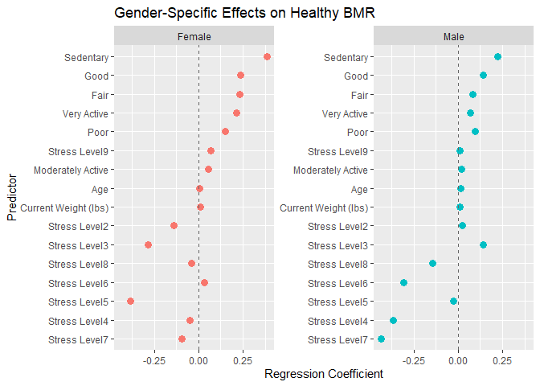
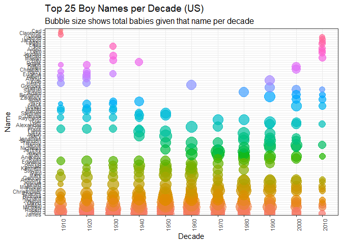
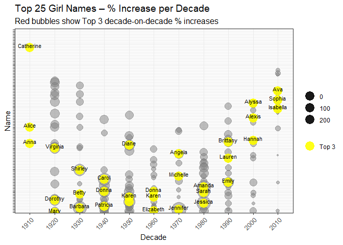
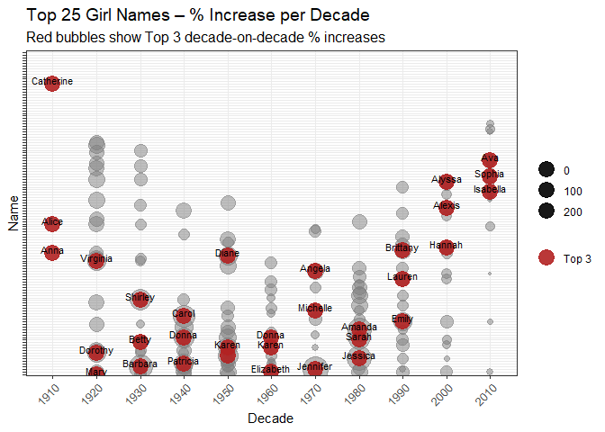
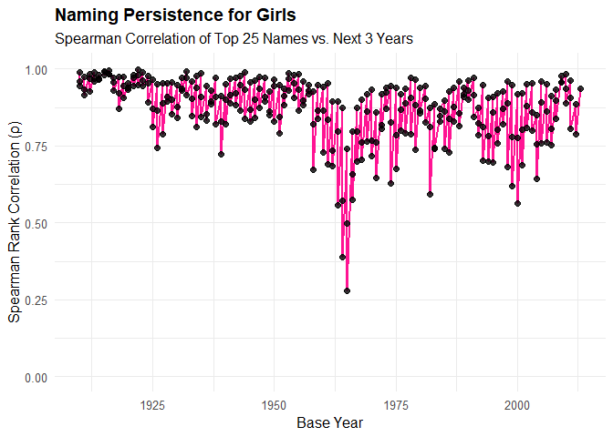
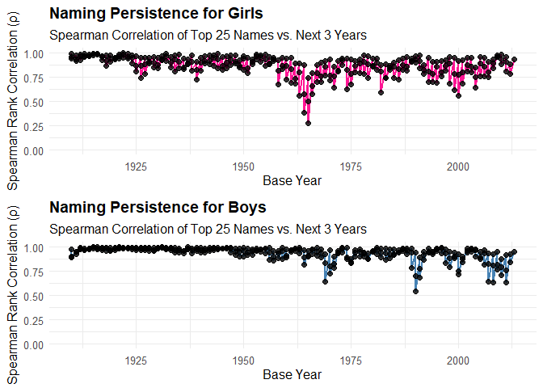

# Purpose

This README will take you through my DATA Science 871 exam. All
questions, data wrangling and analyses will be outlined in this
document.

``` r
rm(list = ls()) # Clean your environment:
gc() # garbage collection - It can be useful to call gc after a large object has been removed, as this may prompt R to return memory to the operating system.
```

    ##           used (Mb) gc trigger (Mb) max used (Mb)
    ## Ncells  546810 29.3    1219124 65.2   686380 36.7
    ## Vcells 1041052  8.0    8388608 64.0  1876260 14.4

``` r
library(tidyverse)
```

    ## ── Attaching core tidyverse packages ──────────────────────── tidyverse 2.0.0 ──
    ## ✔ dplyr     1.1.4     ✔ readr     2.1.5
    ## ✔ forcats   1.0.0     ✔ stringr   1.5.1
    ## ✔ ggplot2   3.5.1     ✔ tibble    3.3.0
    ## ✔ lubridate 1.9.4     ✔ tidyr     1.3.1
    ## ✔ purrr     1.0.4     
    ## ── Conflicts ────────────────────────────────────────── tidyverse_conflicts() ──
    ## ✖ dplyr::filter() masks stats::filter()
    ## ✖ dplyr::lag()    masks stats::lag()
    ## ℹ Use the conflicted package (<http://conflicted.r-lib.org/>) to force all conflicts to become errors

``` r
library(lubridate)
library(stringr)
library(readr)

list.files('code/', full.names = T, recursive = T) %>% .[grepl('.R', .)] %>% as.list() %>% walk(~source(.))
list.files('./22894551_Exam/Question1/code', full.names = T, recursive = T) %>% .[grepl('.R', .)] %>% as.list() %>% walk(~source(.))


# Creation of question folders
library(Texevier)

#fmxdat::make_project(Open = T)

#just to show I can use glue::glue :)

# CHOSEN_LOCATION <- "C:/Users/Charisa/OneDrive - Stellenbosch University/Documents/22894551_Exam"
# 
# Texevier::create_template(directory = glue::glue("{CHOSEN_LOCATION}/"), template_name = "Question1")
# Texevier::create_template(directory = glue::glue("{CHOSEN_LOCATION}/"), template_name = "Question2")
# Texevier::create_template(directory = glue::glue("{CHOSEN_LOCATION}/"), template_name = "Question3")
# Texevier::create_template(directory = glue::glue("{CHOSEN_LOCATION}/"), template_name = "Question4")
# Texevier::create_template(directory = glue::glue("{CHOSEN_LOCATION}/"), template_name = "Question5")

# I added the data to the respective question data folders
# I also added the instruction PDF to the settings folder of the root. 
```

# QUESTION 1: US BABY NAMES

Step 1: uploading the data, view the format with view(Baby\_/Names)

``` r
Baby_Names <- read_rds("./data/PracData25/US_Baby_names/Baby_Names_By_US_State.rds")
Top_100_Billboard <- read_rds("./data/PracData25/US_Baby_names/charts.rds")
HBO_titles <- read_rds("./data/PracData25/US_Baby_names/HBO_titles.rds")
HBO_credits <- read_rds("./data/PracData25/US_Baby_names/HBO_credits.rds")

view(Baby_Names)
view(Top_100_Billboard)
view(HBO_titles) # need to merge these to to have the release date with the actors/ characters names
view(HBO_credits)

#Join the HBO titles and credits
HBO_joined <- HBO_credits %>%
  left_join(HBO_titles, by = "id")
```

I came across a biggggg issue with the naming conventions of the “year”
and “name” columns, so I decided to rather change the functions back to
using “name” and “year” for simplicity and to then rename the columns in
each dataset. This felt more simple!

``` r
#tidy up the column names for ease of use: 
Baby_Names <- Baby_Names %>%
  rename(name = Name) %>% rename(year = Year)

#Now, since I want to compare the correlation for girls and boys separately, I need to infer the gender of the HBO and Billboard lists - which I can do by looking each name up in the US-babynames dataset.

# add gender & rename name columns

Top_100_Billboard <- Top_100_Billboard %>% rename(name = artist) #the dates is in numeric here, can add year col
Billboard_MF <- add_gender(df = Top_100_Billboard)

#Hbo artists
HBO_MF <- add_gender(HBO_joined)

#HBO_MF_new <- charadd_gender(HBO_MF)

#now apply to character
HBO_characters_MF <- HBO_MF %>%  rename(actor_name = name) %>% rename(name = character) %>% rename(year = release_year)


# drop unnecessary dataframes
rm(Top_100_Billboard, HBO_credits, HBO_titles, HBO_joined)
```

### Planning:

I will work at a national level. I want to have a summary table (bubble
plot) at the end with the 5 most popular names for each decade for boys
and girls. Interesting: Comparing persistence between TV characters and
actors/ music songs or artists

1.  factors influencing naming
2.  persistence of the trends

Putting this on a plot e.g. with Years or Decades on the Y-axis and most
popular Names on the X (N being the size of the name bubble), popular
character names in adult or children series. . . ’ ’

First I need to find the most popular baby names in each year and the
most popular TV celebrities in each year and the most popular songs /
artists in each year

## Baby Names

Since I want to work with decades: I need to create some functions that
will sort the names in the top 25 order for each decade.

``` r
#check if year is numeric
str(Baby_Names$Year)
```

    ## Warning: Unknown or uninitialised column: `Year`.

    ##  NULL

``` r
#create function to add decade column: decade_creator
#create function to create top25 names with a gender filter: Top25_Names_decade
```

It works better if I combine these two functions into the
Top25_Names_decade function!

``` r
# create top25 lists with the decade_Creator function and arrange by popularity
# just checking that it works: 

Top25_boynames_decade <- Top25_Names_by_Decade(Baby_Names, gender_filter = "M")
Top25_girlnames_decade <- Top25_Names_by_Decade(Baby_Names, gender_filter = "F")
```

I first created a function only for one of the genders and then amended
it to be more generic with a gender_filter so that we can use it
throughout.

### Top25_plot

``` r
# I loaded my plot_orderset function

top25_girlsplot <- top25_plot(df = Baby_Names, xaxis_size = 10, xaxis_rows = 2, gender_filter = "F")
top25_girlsplot
```



``` r
top25_boysplot <- top25_plot(df = Baby_Names, xaxis_size = 10, xaxis_rows = 2, gender_filter = "M")
top25_boysplot
```



I further wanted to identify names that were taken up more than usual in
each decade. So I created a function to extract that. Afterwards, I
added another geom_text to name each of the top 3 names taken up such
that

### Increase year-on-year

Create function for the increase year-on-year by decade! Now I can see
the surges. I also added the function that it shows the top 3 names each
decade and makes them a different colour.

``` r
top25_increaseplot(Baby_Names)
```

    ## Warning: Removed 123 rows containing missing values or values outside the scale range
    ## (`geom_point()`).



``` r
top25_increaseplot(Baby_Names, gender_filter = "F")
```

    ## Warning: Removed 123 rows containing missing values or values outside the scale range
    ## (`geom_point()`).



## HBO - movies and TV

Now, since I want to compare the correlation for girls and boys
separately, I need to infer the gender of the HBO and Billboard lists -
which I can do by looking each name up in the US-babynames dataset.

! I added the genders at the beginning.

Now we can order the characters by their TMBD score in each decade and
capture the top 25 male and female actors in each decade. I first wanted
to see what the most popular names in TV characters was by applying the
top25 plot. This isn’t working right now because the column names don’t
match but I don’t want to break something that is workign for the other
functions, so I’m going to continue with the ordering!

Let’s just get the top 25 actors and actresses and the top 25 male and
female character names.

<!-- ```{r} -->
<!-- top25_girlscharactersplot <- top25_plot(df = HBO_characters_MF, xaxis_size = 10, xaxis_rows = 2, gender_filter = "F", year_col = release_year) -->
<!-- top25_girlsplot -->
<!-- top25_boycharactersplot <- top25_plot(df = HBO_characters_MF, xaxis_size = 10, xaxis_rows = 2, gender_filter = "M", year_col = release_year) -->
<!-- top25_boysplot -->
<!-- ``` -->

### Top 25 most popular characters overall

The setup here I don’t like so much, because the big movies’ small roles
are comiing up. I need to filter that only lead/ supporting roles come
up.

I can see the genders are mostly showing up as NA, I presume it is
because the names/ “first word” of the characters likely not correct. I
will now revisit my definition of HBO_characters_MF.

I also want some first names but it might fall away if I do first word.
Some of the character names have special characters that need cleaning

Now let’s do it by decade!

### Popularity per decade

``` r
library(forcats)
# not using this now since the previous is broken

# group_by(decade)
```

Since there are so many names and that becomes cluttered, I opted to
plot this with only the top 3/10 names per decade.

<!-- # ```{r} -->
<!-- # library(stringr) -->
<!-- #  -->
<!-- # Top10_Cleaned <- Top25_Characters_by_Decade %>% -->
<!-- #   mutate( -->
<!-- #     character = str_remove(character, "\\s*\\(uncredited\\)"),        # remove clutter -->
<!-- #     character = str_trunc(character, 40),                             # truncate long labels -->
<!-- #     Gender = factor(Gender, levels = c("F", "M"))                     # consistent ordering -->
<!-- #   ) %>% -->
<!-- #   group_by(decade, Gender) %>% -->
<!-- #   slice_max(order_by = avg_score, n = 10, with_ties = FALSE) %>% -->
<!-- #   ungroup() %>% -->
<!-- #   arrange(Gender, desc(avg_score)) %>% -->
<!-- #   mutate(character_ordered = fct_inorder(character)) -->
<!-- #  -->
<!-- # ggplot(Top10_Cleaned, aes(x = avg_score, y = character_ordered, colour = Gender)) + -->
<!-- #   geom_point(size = 3, alpha = 0.8) + -->
<!-- #   facet_wrap(~decade, scales = "free_y") + -->
<!-- #   theme_minimal(base_size = 11) + -->
<!-- #   labs( -->
<!-- #     title = "Top 10 HBO Characters by Gender and TMDB Score per Decade", -->
<!-- #     subtitle = "Ordered by Gender first, then TMDB Score (highest to lowest)", -->
<!-- #     x = "Avg TMDB Score", y = "Character" -->
<!-- #   ) + -->
<!-- #   theme( -->
<!-- #     axis.text.y = element_text(size = 7), -->
<!-- #     strip.text = element_text(size = 10), -->
<!-- #     legend.position = "top" -->
<!-- #   ) + -->
<!-- #   scale_colour_manual(values = c("F" = "#E377C2", "M" = "#1F77B4")) -->
<!-- <!-- ``` -->

This ALSO looks incredibly janky! I’m going to try to make it a bit more
neat by grouping by gender. I’m also only going to keep names that are
found in the baby_names list.

<!-- ```{r} -->
<!-- Top10_Table <- Top25_Characters_by_Decade %>% -->
<!--   mutate( -->
<!--     character = str_remove(character, "\\s*\\(uncredited\\)"), -->
<!--     character = str_trunc(character, 40), -->
<!--     decade = factor(decade), -->
<!--     Gender = factor(Gender, levels = c("F", "M")) -->
<!--   ) %>% -->
<!--   group_by(decade, Gender) %>% -->
<!--   slice_max(order_by = avg_score, n = 10) %>% -->
<!--   ungroup() %>% -->
<!--   arrange(decade, Gender, desc(avg_score)) %>% -->
<!--   select(Decade = decade, Gender, Character = character, `Avg TMDB Score` = avg_score, Appearances = appearances) -->
<!-- Top10_Table -->
<!-- library(gt) -->
<!-- library(huxtable) -->
<!-- ht <- as_hux(Top10_Table) -->
<!-- ht <- ht %>% -->
<!--   set_caption("Top 10 HBO Characters by Gender and TMDB Score per Decade") %>% -->
<!--   set_bold(1, everywhere, TRUE) %>% -->
<!--   set_number_format(everywhere, "Avg TMDB Score", fmt_pretty(1)) %>% -->
<!--   set_all_border_colors("grey90") %>% -->
<!--   set_all_padding(2) -->
<!-- ht -->
<!-- ``` -->

## BILLBOARD - musicians

I will see if I get to comparing these! It can be interesting to filter
the songs to only those containing a name that appears in the babyname
list.

## COMPARISON OF MATCHES

I want to find the top (n) baby names and see if they match the top (n)
actors and characters in that decade. I use a threshold for a movie to
be considered influential - only the popular movies are likely to have a
big impact on naming. I only take the top 50 actors.

I will create a function that gets the top increasing names, and then
compare them to the top movie actors/actresses in that decade, as well
as the popular movie characters in that decade to find “matches” within
decades and then we can see when it was most popular to do so and
whether it is still a trend in this decade to name your children after
movies/characters.

function: findmatches -\> not working so well function: newfindmatches
-\> will print a message saying what % matches there were!

This chunk is not working :( Need to come back to this!

``` r
# result_girls <- findmatches_and_matchrate(Baby_Names, top_n = 25)
# print(result_girls$message)
# 
# result_boys <- findmatches_and_matchrate(Baby_Names, gender_filter = "M", top_n = 25)
# print(result_boys$message)
```

## SPEARMAN CORRELATION PLOTS

We want to see naming persistence over time - thus we want to see if top
names stay top names over time (year-on-year)

What is the correlation between this period and future periods/ past
periods popularity of name usage for girls and boys.

``` r
Spearman(Baby_Names)
```



I want to see them together/ next to each other

``` r
spearman_girls <- Spearman(df = Baby_Names, gender_filter = "F")
# spearman_girls

spearman_boys <- Spearman(df = Baby_Names,  gender_filter = "M")
# spearman_boys

# see side by side
cowplot::plot_grid(spearman_girls, spearman_boys, ncol = 1)
```


